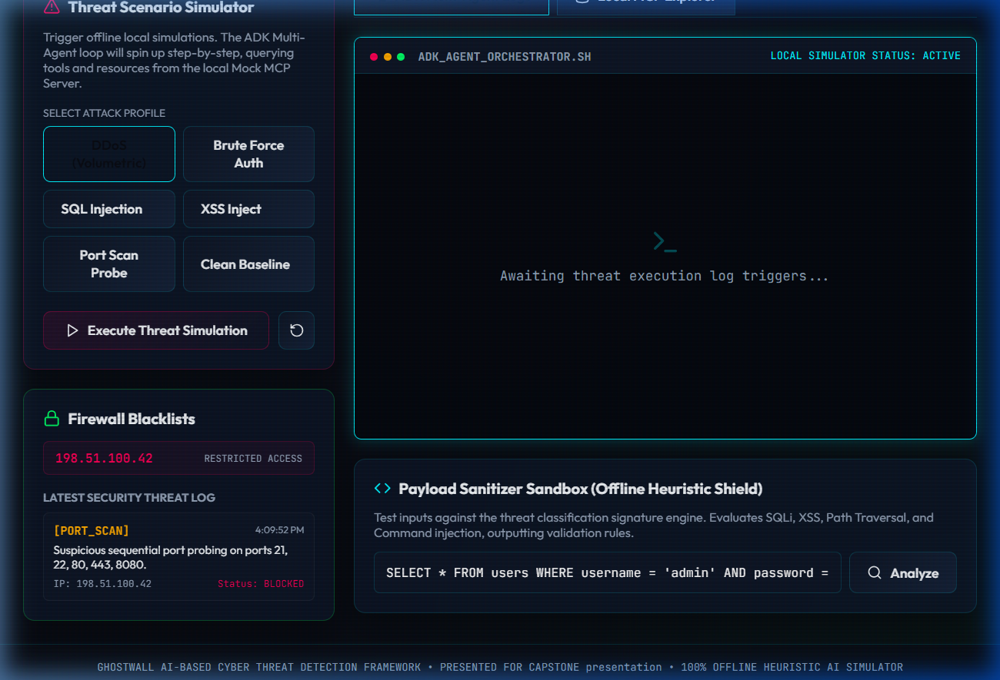
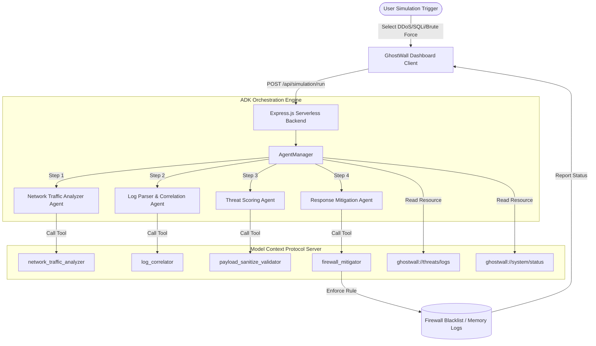

# 🛡️ GhostWall - AI-Based Cyber Threat Detection Framework

[](https://reactjs.org/)
[](https://www.typescriptlang.org/)
[](https://nodejs.org/)
[](https://vitejs.dev/)
[](https://expressjs.com/)
[](https://vercel.com/)
[](https://opensource.org/licenses/MIT)

GhostWall is a full-stack, completely offline, AI-powered Cyber Threat Detection Framework. Designed with a premium, high-visibility security dashboard, GhostWall serves as a mock defensive operations console. It demonstrates how multi-agent security orchestrations (ADK) can scan network traffic, correlate audit logs, evaluate threat payloads, and trigger active firewall blocks—entirely locally and without external API dependencies.

🔗 **Live Demo URL**: [https://ghostwall.vercel.app](https://ghostwall.vercel.app) *(Build ready for Vercel deployment)*

---

## 📊 Visual Walkthrough & Screenshots

### 💻 System Security HUD
The main dashboard features glassmorphic control cards, a system health score index, real-time restricted IP counters, and throughput meters.



### 📹 Real-Time Agentic Response Simulation
Watch the local multi-agent system respond step-by-step to a volumetric DDoS attack and sanitize inputs in the payload scanner:


---

## 🎯 Key Features

- **ADK Multi-Agent System**: Orchestrates specialized security agents working in a collaborative pipeline.
- **Model Context Protocol (MCP)**: Implements an offline JSON-RPC MCP structure to register resources and tools that agents can query and trigger.
- **Threat Simulator**: Interactively trigger simulated attack vectors (DDoS, Brute Force, SQL Injection, XSS, Port Scans) and witness immediate real-time defensive reactions.
- **Payload Sanitizer Sandbox**: An interactive playground demonstrating strict static sanitization methods (SQLi, XSS, Traversal, Command Injection) with zero risk of code execution.
- **CLI Utility Skills**: Built-in script tools for directory log scanning and independent payload validation.
- **Modern Obsidian Styling**: Sleek cyberpunk theme featuring glowing neon status indicators, interactive SVG icons, and a custom command-line log viewer.

---

## 🛠️ Tech Stack

- **Frontend**: React 18, Vite 5, Lucide Icons, Vanilla HSL CSS Variables (Obsidian glassmorphism design system)
- **Backend**: Node.js, Express, Body Parser, CORS
- **Type Safety**: TypeScript 5
- **Deployment**: Vercel (integrated with Serverless Functions for full-stack compatibility)
- **Orchestration**: ADK (Agent Development Kit) simulation engine

---

## 🏗️ System Architecture

GhostWall models a standard SOC (Security Operations Center) pipeline:



### 🤖 Agent Directory & Roles
1. **Network Traffic Analyzer Agent**: Scans connections for volumetric patterns (e.g. DDoS volume threshold anomalies).
2. **Log Parser & Correlation Agent**: Links authentication failures with scanning events to spot multi-stage campaigns.
3. **Threat Classification & Scoring Agent**: Inspects exploit payloads and assigns risk index scores (0-100).
4. **Automated Response Mitigation Agent**: Determines containment actions (`BLOCK_IP`, `RATE_LIMIT`, `ISOLATE_SUBNET`).

---

## 📂 Project Directory Structure

```text
├── api/
│   └── index.ts                 # Vercel serverless entry point
├── assets/
│   ├── initial_dashboard_view.png
│   └── ghostwall_threat_simulation_demo.webp
├── server/
│   ├── index.ts                 # Express application & API routing
│   ├── mcp-server.ts            # Mock MCP JSON-RPC Server
│   ├── adk/
│   │   ├── agent-manager.ts     # Multi-agent orchestrator loop
│   │   ├── network-agent.ts     # Network security agent
│   │   ├── log-agent.ts         # Correlation agent
│   │   ├── threat-agent.ts      # Scoring agent
│   │   └── mitigation-agent.ts  # Firewall mitigation agent
│   └── scripts/
│       ├── log-collector.ts     # CLI Log Analyzer skill script
│       └── payload-validator.ts # Standalone static payload scanner
├── src/
│   ├── App.tsx                  # Dashboard interface component
│   ├── main.tsx                 # React DOM bootstrapper
│   ├── index.css                # Obsidian cyber theme CSS styles
│   └── vite-env.d.ts            # Vite client type bindings
├── index.html                   # HTML entry (Outfit & JetBrains Fonts)
├── package.json                 # Project dependencies & build automation
├── tsconfig.json                # TypeScript compilation config
├── vercel.json                  # Vercel deployment rewrite routes
└── vite.config.ts               # Vite configuration with proxy settings
```

---

## 🚀 Quick Setup & Installation

### Prerequisites
- Node.js (v18+)
- npm (v9+)

### Local Development
1. Clone the repository and install dependencies:
   ```bash
   git clone https://github.com/anshikasingh28072006/GhostWall.git
   cd GhostWall
   npm install
   ```

2. Run the full application locally:
   ```bash
   npm run dev
   ```
   This concurrent script launches the React client on [http://localhost:3000](http://localhost:3000) and proxy-binds to the Express backend API on [http://localhost:3001](http://localhost:3001).

### CLI Security Tools
You can execute standalone tools directly in your terminal:
```bash
# Run log parser skill
npx ts-node server/scripts/log-collector.ts

# Run payload validator skill
npx ts-node server/scripts/payload-validator.ts "SELECT * FROM users WHERE 1=1"
```

---

## ⚡ Vercel Deployment Instructions

GhostWall has been optimized to deploy as a full-stack serverless app on Vercel:

1. **Push Changes to GitHub**:
   Ensure all local changes are committed and pushed to your repo.
2. **Import Project to Vercel**:
   - Go to [Vercel Dashboard](https://vercel.com) and click **Add New** -> **Project**.
   - Import the `GhostWall` repository.
3. **Configure Settings**:
   - **Framework Preset**: Vite
   - **Root Directory**: `./` (leave default)
   - **Build Command**: `npm run build` (runs `tsc && vite build`)
   - **Output Directory**: `dist`
4. **Deploy**: Click **Deploy**. Vercel will bundle the React client and host the Express backend via Serverless Functions under `api/index.ts` automatically based on the `vercel.json` rewrites.

---

## 🔮 Future Improvements

- Add a live interactive threat map visualizing blocked geo-IP markers.
- Implement exportable CSV reports for compliance auditing.
- Expand signature lists to include SQLi-to-shell patterns.
- Integrate WebSockets for live logging feeds.

---

## 👥 Author & Contact

- **Author**: Anshika Singh
- **GitHub**: [@anshikasingh28072006](https://github.com/anshikasingh28072006)
- **Role**: Cyber Security Analyst & Developer